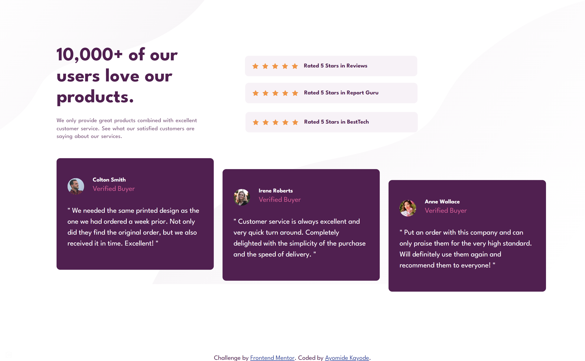
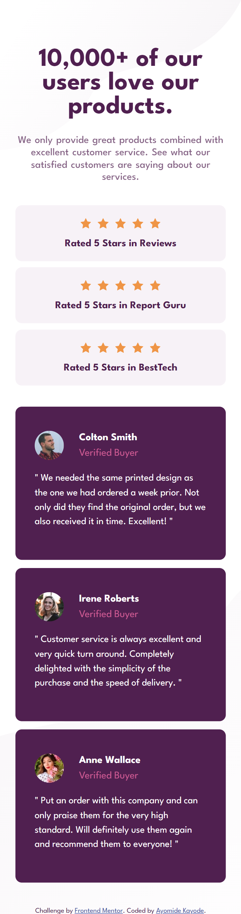

# Frontend Mentor - Social proof section solution

This is a solution to the [Social proof section challenge on Frontend Mentor](https://www.frontendmentor.io/challenges/social-proof-section-6e0qTv_bA). Frontend Mentor challenges help you improve your coding skills by building realistic projects.

## Table of contents

- [Overview](#overview)
  - [The challenge](#the-challenge)
  - [Screenshot](#screenshot)
  - [Links](#links)
- [My process](#my-process)
  - [Built with](#built-with)
  - [What I learned](#what-i-learned)
- [Author](#author)

## Overview

### The challenge

Users should be able to:

- View the optimal layout for the section depending on their device's screen size.

- See the ratings and card interactions when hovered over.

- A 100vh when in desktop mode.

### Screenshot




### Links

- Solution URL: [Add solution URL here](https://your-solution-url.com)
- Live Site URL: [Add live site URL here](https://your-live-site-url.com)

## My process

I started this challenge by building the mobile view of the layout first. And then I transitioned into the desktop view making the necessary adjusments to the layout.

### Built with

- Semantic HTML5 markup
- CSS custom properties
- Flexbox
- CSS Grid
- Mobile-first workflow

### What I learned

While building this, I really got to deeply understand Grid and Flexbox as I used both models for majority of the styling in this project.

Getting the grid properties to adjust to respective columns/rows was also fun to tackle, see below:

```css
.testimonials-container {
  grid-column: 1 / 3;
  display: grid;
  grid-template-columns: repeat(3, 1fr);
  grid-template-rows: 1fr;
  gap: 1.5rem;
}
```

```css
main {
  margin: 3.175rem;
  grid-template-columns: 35% 65%;
  grid-template-rows: 0.6fr 450px;
  gap: 3rem;
  transform: scale(0.9);
}
```

## Author

- Website - [Ayomide Kayode](https://github.com/AyomideKayode)
- Frontend Mentor - [@AyomideKayode](https://www.frontendmentor.io/profile/AyomideKayode)
- Twitter - [@kazzy_wiz](https://www.twitter.com/kazzy_wiz)
